**完整代码收费  加qq  931708230 或者加微信  ynwwxid**

**接毕业设计和论文**

**博客地址：[https://blog.csdn.net/2303_76227485/article/details/128650012](https://blog.csdn.net/2303_76227485/article/details/128650012)**

**视频演示：[https://space.bilibili.com/384537280](https://space.bilibili.com/384537280)**

**毕业设计所有选题地址：[https://github.com/ynwynw/allProject](https://github.com/ynwynw/allProject)**

## 基于springboot的宠物商城系统(源代码+数据库)

## 一、系统介绍

#### 未注册用户

非注册用户（即游客身份）进入宠物官网首页，可以浏览关于宠物的宣传以及医院发布的文章，进入宠物商城浏览正在发售的商品，搜索已发布的文章和商品，注册以及登录。

#### 已注册用户

注册用户可以修改个人信息和宠物信息，发布预约单（预约医生和美容师），在医院的商城购物，收藏商品，给官方留言，查看与自己相关的记录信息，如：病例记录、预约记录、问诊记录、订单记录等，注销退出系统。

#### 业务管理员

业务管理员具有进货管理（包括进货入库、退货出库、进货单据查询、退货单据查询以及当前库存查询）、销售管理（包括销售出库、客户退货入库、销售单据查询、退货单据查询）、库存管理（包括商品报损、商品报溢、库存报警、报损报溢记录查询）、查看统计数据（供应商进退货单统计、客户进退货单统计、按日统计销售利润、按月统计销售利润）、供应商管理、客户管理、商品管理、期初库存管理、前台轮播图管理、设备类型管理、设备管理、设备使用管理、设备使用记录管理、文章类型管理、文章管理、客户留言管理、医院用品管理、医院用品出入库管理、医院用品出入库记录管理、客户消息管理、客户订单处理、客户预约单管理、客户问诊记录管理、病历单管理、化验记录管理、疫苗注射记录管理、客户回访记录管理、寄养记录管理、修改密码、安全退出系统。

#### 系统管理员

系统管理员除了具备业务管理员的所有权限外，还有创建角色并赋予角色权限的功能，还可以查看系统操作日志。

#### 系统自身

系统每天0点自动创建明天的分别属于各个医生或美容师各个时间段的空预约单（未被客户接受的预约单）、每分钟自动筛选出5分钟后过期的空预约单并从数据库删除、每分钟自动筛选和取消客户提交的超过一天未支付的订单并释放库存、每天凌晨1点自动将发布日期超过3个月的商品的"新品"标签去掉、医院上班后（8点）系统自动给当天有预约的客户发送提醒消息

## 二、所用技术

本项目核心技术采用Spring Boot+Mybatis；开发工具idea；数据库MySQL5.6；模版引擎采用的是Thymeleaf；安全框架采用Shiro，实现了完整权限系统，Controller方法采用Shiro注解来实现有效的权限控制；前台界面采用了Bootstrap技术；后台界面采用了EasyUI技术；

后端技术栈：

- Spring Boot+Mybatis+mysql+Shiro

前端技术栈：

- Thymeleaf
- 前台界面采用了Bootstrap技术；后台界面采用了EasyUI

## 三、环境介绍

基础环境 :IDEA/eclipse, JDK 1.8, Mysql5.7及以上，Maven

源码+数据库脚本

所有项目以及源代码本人均调试运行无问题 可支持远程调试运行

## 四、页面截图

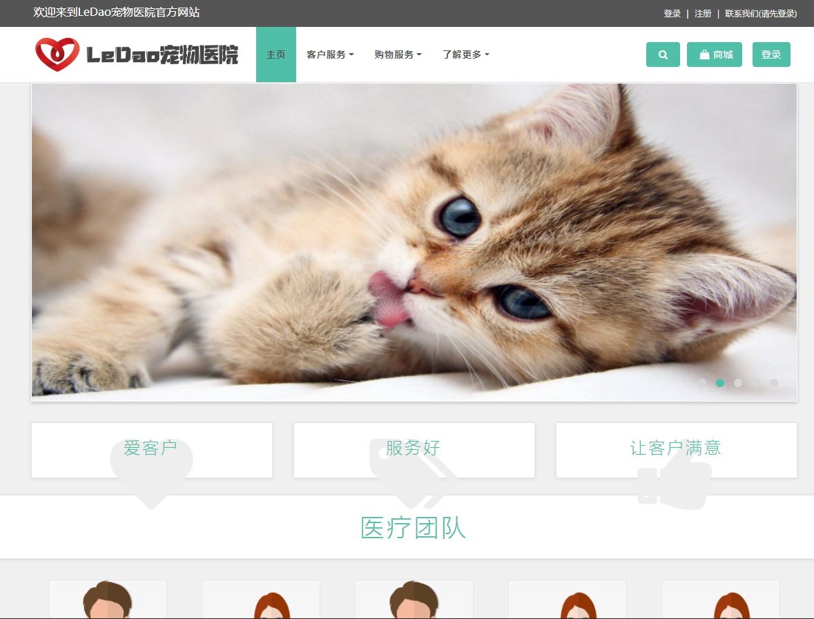

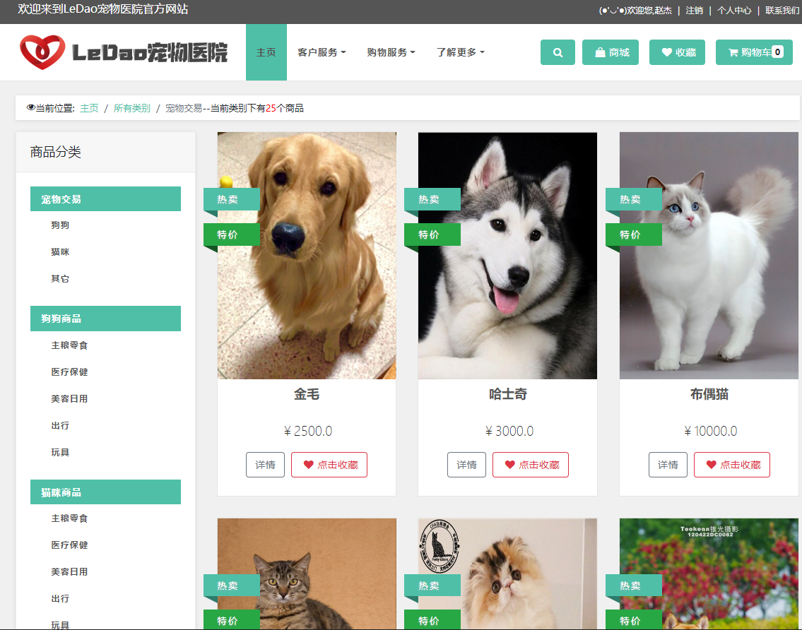

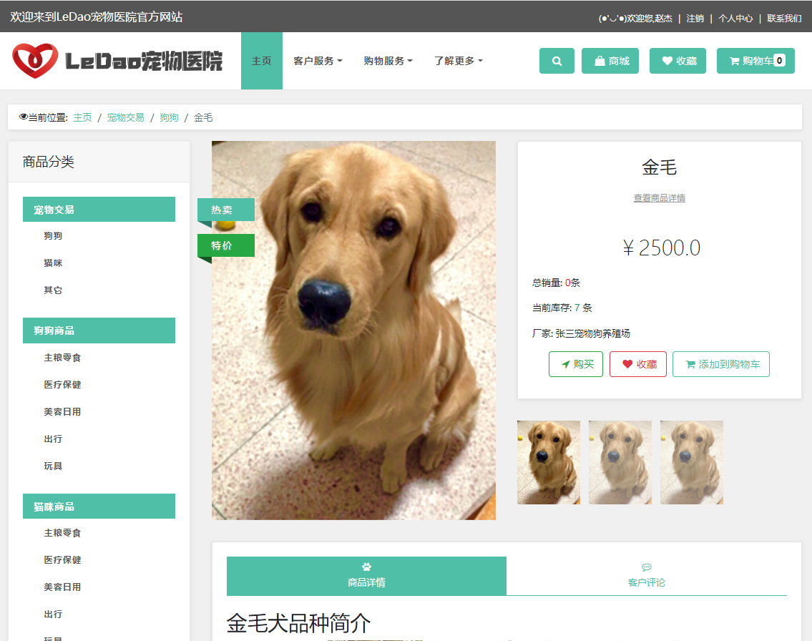

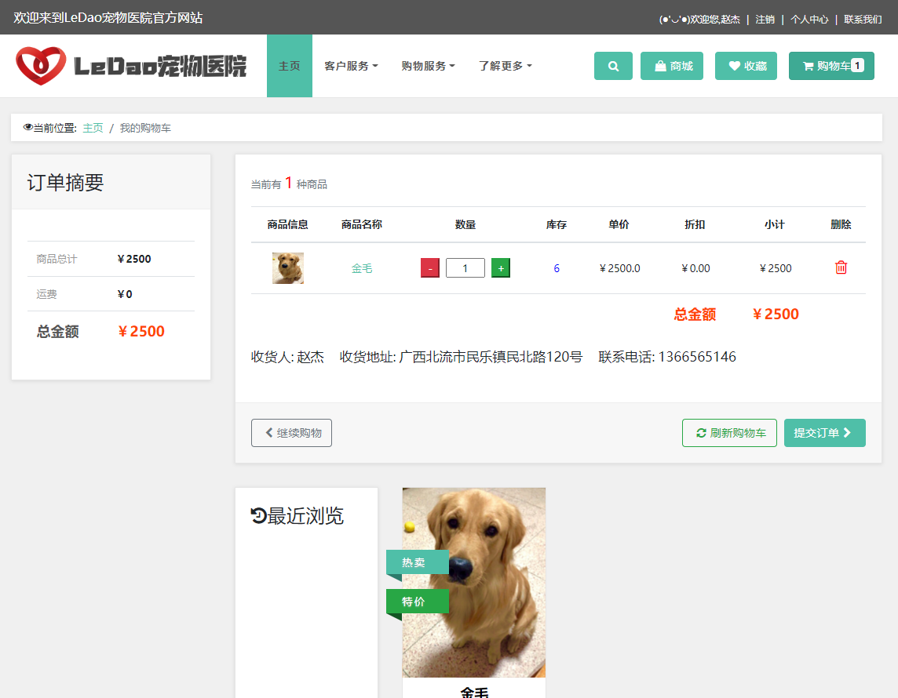

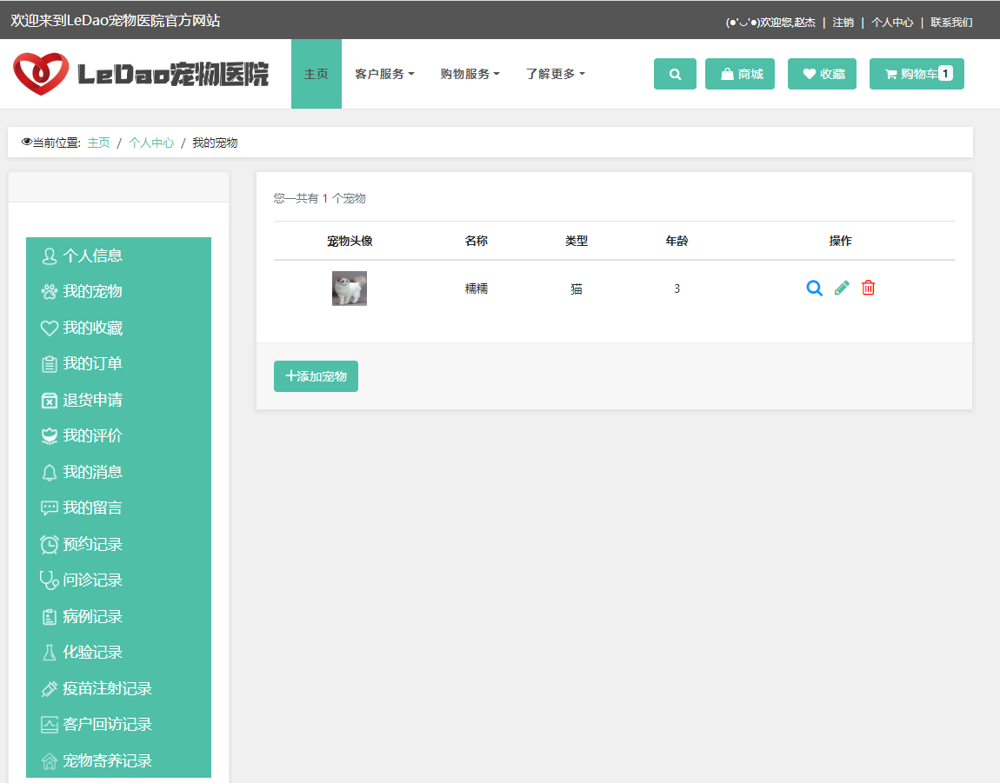

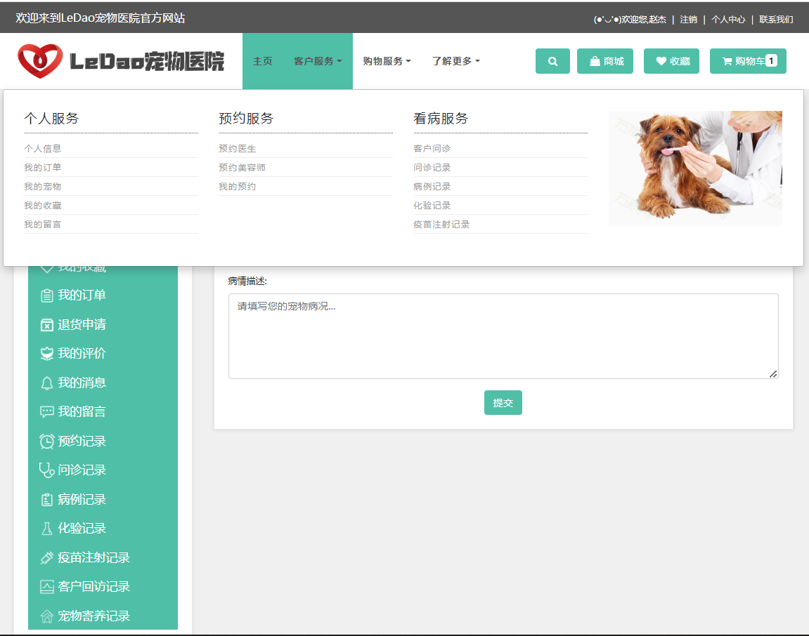

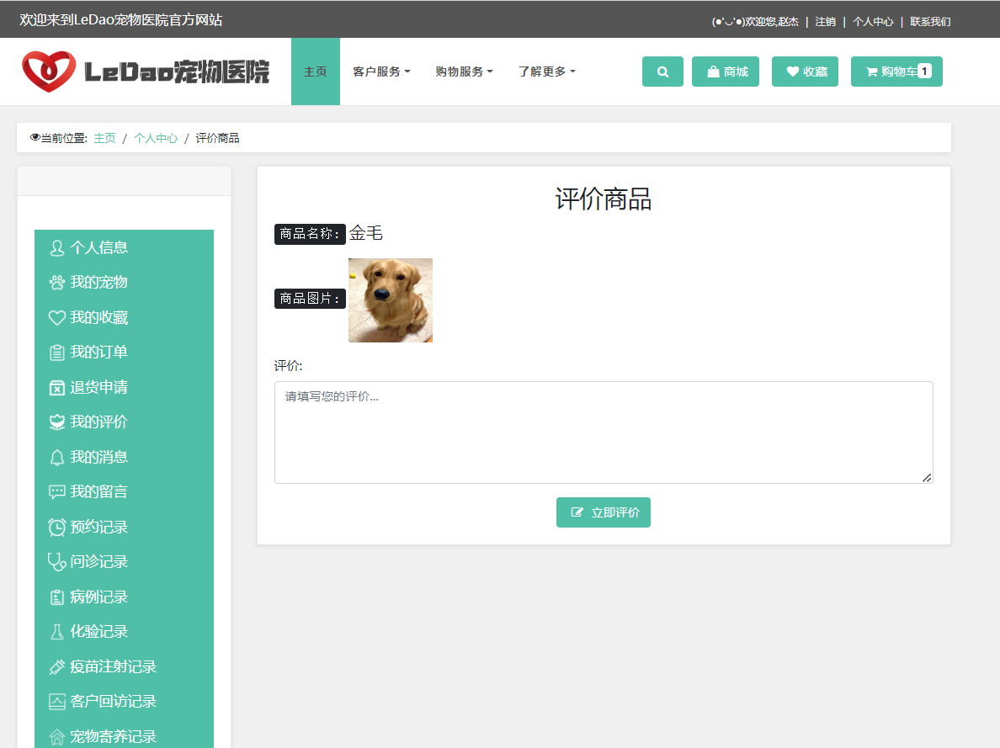

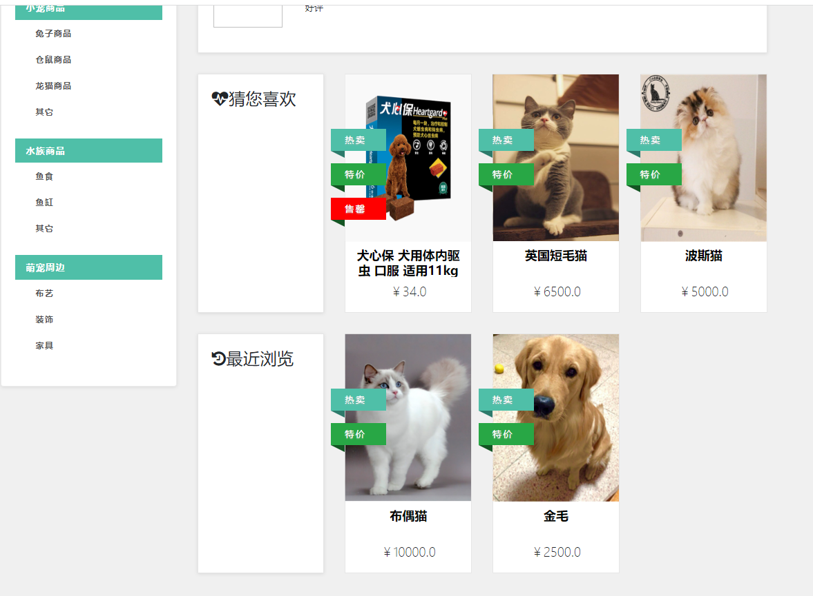

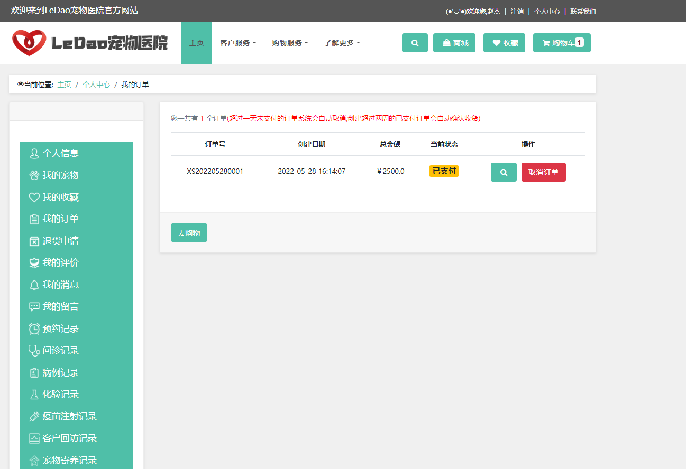

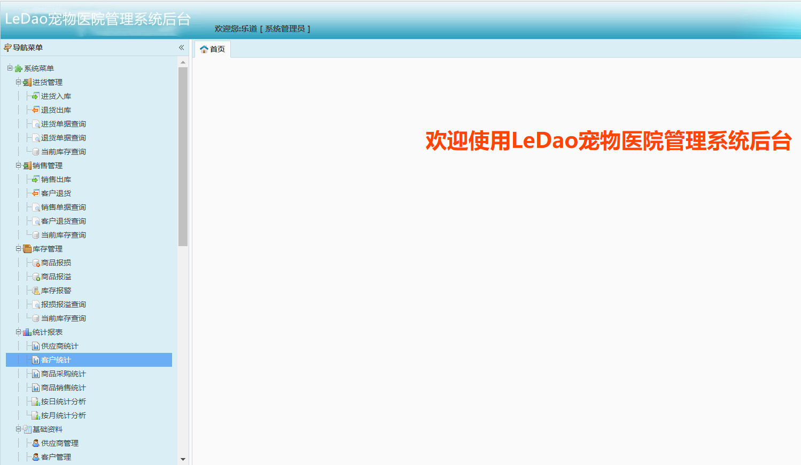

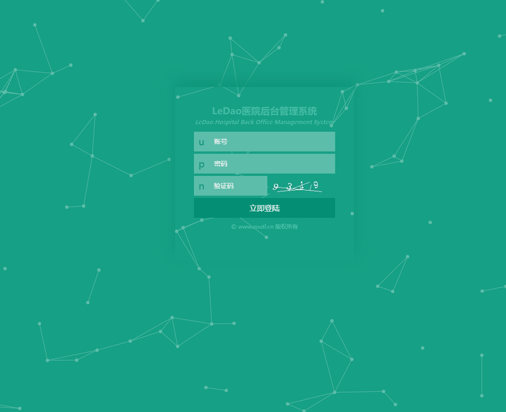

## 五、浏览地址

#### 前台

http://localhost:8094/

普通用户  用户名：a1203007469  密码：123456

#后台访问地址

http://localhost:8094/login.html

管理员    用户名：admin  密码：admin  

## 六、安装教程

1. 使用Navicat或者其它工具，在mysql中创建对应名称的数据库，并导入项目的sql文件；
2. 使用IDEA/Eclipse/MyEclipse导入项目，Eclipse/MyEclipse导入时，若为maven项目请选择maven;
   若为maven项目，导入成功后请执行maven clean;maven install命令，然后运行；
3. 修改application.yml 里面的数据库配置和redis配置
4. 启动项目后端项目 
5. 访问浏览地址

**需要完整代码可以加扣扣  931708230 或者加卫星  ynwwxid**

